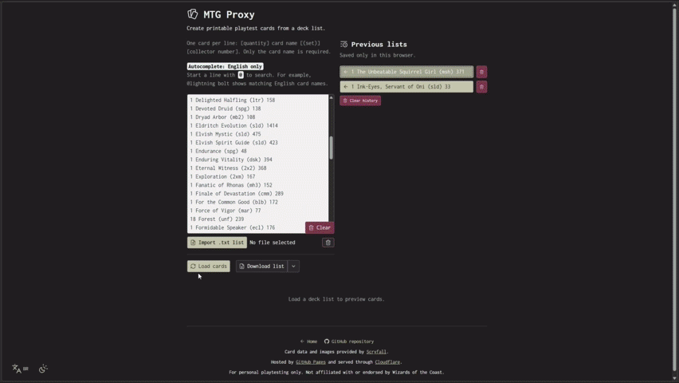
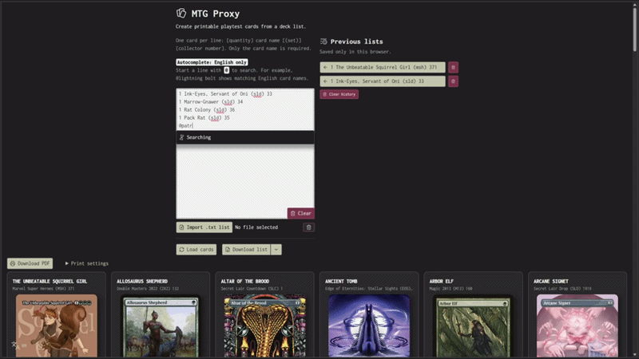
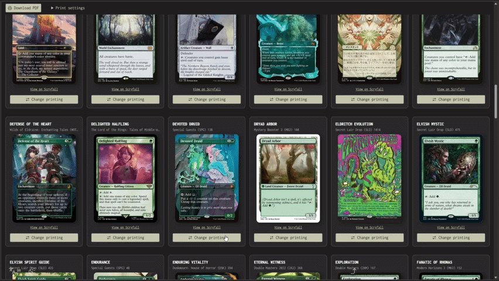

# MTG Proxy

Create printable Magic: The Gathering playtest cards in your browser.

[Open MTG Proxy](https://lksvn.com.br/mtg-proxy/) · [Open the Custom Card Editor](https://lksvn.com.br/mtg-proxy/#editor)



Load a deck list to find card images through Scryfall, choose printings, and download a print-ready PDF. Or use the custom editor to make an ordinary single-faced card and export a 1500 × 2100 PNG. The interface supports English and Brazilian Portuguese.

## Deck-list format

Enter one card per line. Quantity, set, and collector number are optional:

```text
Lightning Bolt
4 Lightning Bolt
1 Black Lotus (lea) 232
```

Type `@` before a name for English autocomplete, for example `4 @counter`.



After loading a list, you can search for a different printing before downloading the PDF.



## Development

Requires Node.js and npm.

```sh
npm install
npm run dev
```

```sh
npm test
npm run lint
npm run build
```

## Credits

Card data and images come from [Scryfall](https://scryfall.com/). Custom frame assets are credited in [`public/img/frames`](public/img/frames).

For personal, non-commercial playtesting. Not affiliated with or endorsed by Wizards of the Coast. Deck lists stay in your browser except for card lookups; custom-editor artwork and state stay in the current tab.
