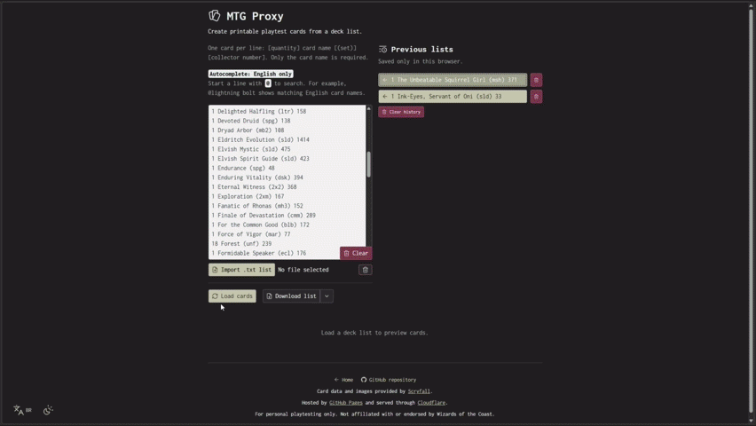
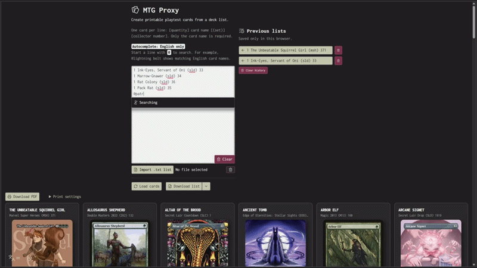
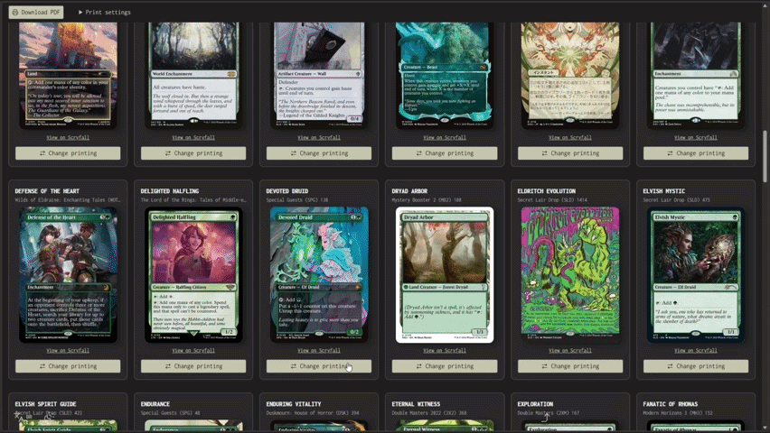
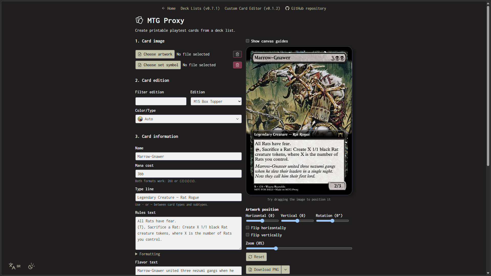

# MTG Proxy

Create printable Magic: The Gathering playtest cards from deck lists or your own designs. Available in English and Brazilian Portuguese.

[Open MTG Proxy](https://lksvn.com.br/mtg-proxy/) · [Open the Custom Card Editor](https://lksvn.com.br/mtg-proxy/#editor)



*MTG Proxy overview.*

## Deck Lists

Find cards through Scryfall and export a print-ready PDF.

- Paste lists or import `.txt`/`.md` files.
- Search names with `@` autocomplete in English.
- Choose different printings and artwork.
- Include custom cards with quantities.

One card per line; quantity and printing details are optional:

```text
Lightning Bolt
4 Lightning Bolt
1 Black Lotus (lea) 232
```



*Find card names with autocomplete.*



*Search and select a card printing.*

## Custom Card Editor

[Create custom cards](https://lksvn.com.br/mtg-proxy/#editor) with your own artwork and text.

- Choose from different frames and layouts.
- Drag and zoom artwork directly in the preview.
- Apply grayscale or inverted artwork colors.
- Download PNGs or add cards to a deck list for PDF printing.

More frame styles are still being added.



*Custom card editor preview.*

## Development

Requires Node.js and npm.

```sh
npm install
npm run dev
```

```sh
npm test
npm run lint
npm run build
```

Pull requests to `main` run tests, lint, and build automatically.

## Credits

Card data and images come from [Scryfall](https://scryfall.com/). Custom frame assets are credited in [`public/img/frames`](public/img/frames).

For personal, non-commercial playtesting. Not affiliated with or endorsed by Wizards of the Coast.
